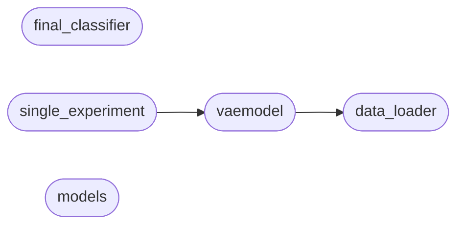

# Code Overview

[_Documentation generated by Documatic_](https://www.documatic.com)

<!---Documatic-section-Codebase Structure Python-start--->
## Codebase Structure Python

The codebase has a flat structure, with 5 code files.

<!---Documatic-block-system_architecture-start--->

<!---Documatic-block-system_architecture-end--->

# #
<!---Documatic-section-Codebase Structure Python-end--->

<!---Documatic-section-File IO-start--->
## File IO

<!---Documatic-block-file_io-start--->
The following files have file read operations

<!---Documatic-block-model-start--->

	
<code>model</code> (Click to Expand!)

* model.data_loader

<!---Documatic-block-model-end--->
<!---Documatic-block-file_io-end--->

# #
<!---Documatic-section-File IO-end--->

<!---Documatic-section-Class Hierarchy-start--->
## Class Hierarchy

<!---Documatic-block-model.final_classifier.TrainDataset-start--->

	
<code>model.final_classifier.TrainDataset</code> (Click to Expand!)

* model.final_classifier.TrainDataset

<!---Documatic-block-model.final_classifier.TrainDataset-end--->

<!---Documatic-block-nn.Module-start--->

	
<code>nn.Module</code> (Click to Expand!)

* model.models.decoder_template
* model.models.encoder_template
* model.vaemodel.LINEAR_LOGSOFTMAX
* model.vaemodel.Model

<!---Documatic-block-nn.Module-end--->

<!---Documatic-block-object-start--->

	
<code>object</code> (Click to Expand!)

* model.data_loader.DATA_LOADER

<!---Documatic-block-object-end--->

# #
<!---Documatic-section-Class Hierarchy-end--->

[_Documentation generated by Documatic_](https://www.documatic.com)