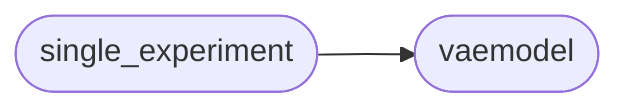

# Model Single Experiment

[_Documentation generated by Documatic_](https://www.documatic.com)

<!---Documatic-section-Codebase Structure-start--->
## Codebase Structure

<!---Documatic-block-system_architecture-start--->

<!---Documatic-block-system_architecture-end--->

# #
<!---Documatic-section-Codebase Structure-end--->

<!---Documatic-section-model.single_experiment.str2bool-start--->
## model.single_experiment.str2bool

<!---Documatic-section-str2bool-start--->
<!---Documatic-block-model.single_experiment.str2bool-start--->
<details>
	<summary><code>model.single_experiment.str2bool</code> code snippet</summary>

```python
def str2bool(v):
    if v.lower() in ('yes', 'true', 't', 'y', '1'):
        return True
    elif v.lower() in ('no', 'false', 'f', 'n', '0'):
        return False
    else:
        raise argparse.ArgumentTypeError('Boolean value expected.')
```
</details>
<!---Documatic-block-model.single_experiment.str2bool-end--->
<!---Documatic-section-str2bool-end--->

# #
<!---Documatic-section-model.single_experiment.str2bool-end--->

[_Documentation generated by Documatic_](https://www.documatic.com)